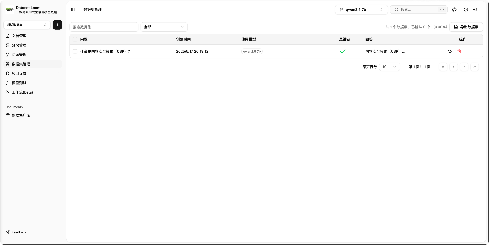
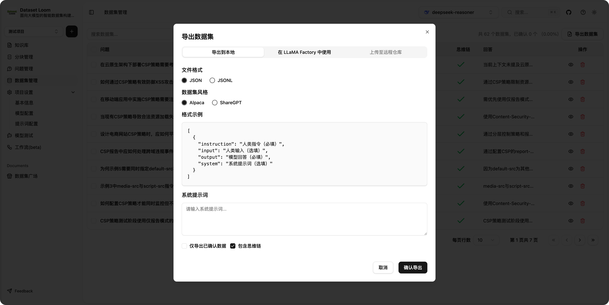
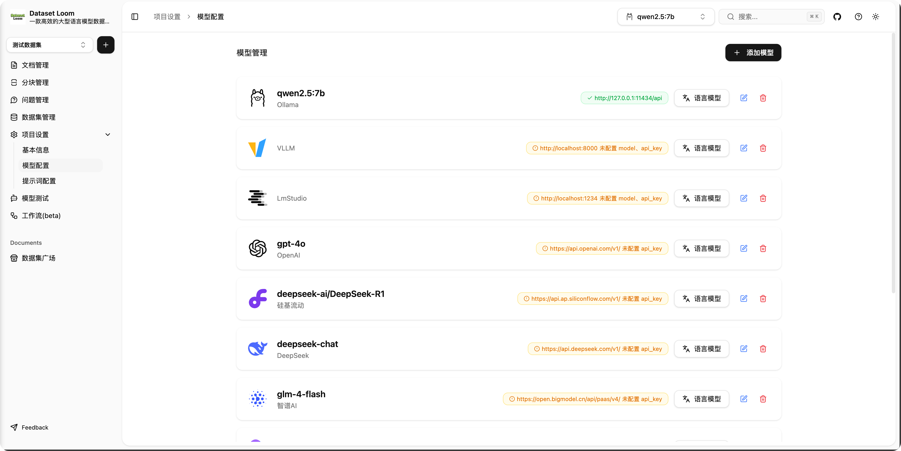

# DatasetLoom


[//]: # ''
[//]: # ''
[//]: # ''
[//]: # ''

> 一个面向大语言模型（LLM）的智能数据集构建工具。

DatasetLoom 是一个基于 [Easy Dataset](https://github.com/ConardLi/easy-dataset) 的全面重构项目，采用现代前端技术栈（TypeScript、Next.js
15、shadcn/ui）重新实现，并进行了大量功能优化与架构升级。

> ⚠️ 本项目为非官方版本

---

## 🧩 项目简介

DatasetLoom 致力于帮助开发者和研究人员快速构建高质量的结构化训练数据集，适用于 LLM 微调、评估、测试等多个场景。

---

## 📸 截图（示例）

| 主页                                                          | 项目列表                                                   |
| ------------------------------------------------------------- | ---------------------------------------------------------- |
|                       |        |
| 知识库                                                        | Chunker策略                                                |
|            |  |
| 分块列表                                                      | 分块合并                                                   |
|              |          |
| 生成问题策略                                                  | 问题列表                                                   |
|  |       |
| 生成数据集策略                                                | 数据集列表                                                 |
|  |       |
| 数据集详情                                                    | 数据集导出                                                 |
|          |     |
| 项目详情                                                      | 模型配置                                                   |
|            |         |
| 项目提示词                                                    | 工作流列表                                                 |
|        |      |
| 工作流详情                                                    | 工作流执行                                                 |
|         |       |

---

## 🚀 快速开始

按照以下步骤快速启动项目：

### 1. 克隆仓库

```bash
git clone https://github.com/599yongyang/DatasetLoom.git
cd DatasetLoom
```

### 2. 创建环境配置文件

在项目根目录中复制 `.env.example` 文件并重命名为 `.env`：

```bash
cp .env.example .env
```

> ⚠️ **重要提示：**
>
> - 如果你计划使用 **工作流功能（Workflow）**，你需要确保已正确配置 Redis：
>
>     ```env
>     REDIS_URL=localhost
>     REDIS_PORT=6379
>     REDIS_PASSWORD=
>     ```
>
> - 工作流功能目前仍处于 **Beta 阶段**，可能存在不稳定或功能迭代，请留意最新动态。
> - 如果你不使用工作流，可以跳过 Redis 相关配置。

---

### 3. 安装依赖

本项目使用 [pnpm](https://pnpm.io/) 进行包管理，请确保你已安装 pnpm：

```bash
pnpm install
```

> 💡 如未安装 pnpm，可通过 npm 快速安装：
>
> ```bash
> npm install -g pnpm
> ```

---

### 4. 启动开发环境

#### 开发服务器（热重载）：

```bash
pnpm run dev
```

服务默认运行在：👉 [http://localhost:2088](http://localhost:2088)

#### 构建与预览生产环境：

```bash
pnpm run build
pnpm run start
```

预览地址同上：👉 [http://localhost:2088](http://localhost:2088)

---

## 📜 第三方代码说明

本项目最初基于 [Easy Dataset](https://github.com/ConardLi/easy-dataset) 的 Apache License 2.0 版本进行重构与优化。

本项目目前采用 [MIT License](LICENSE)，不包含原项目 AGPL 3 的任何新版本代码。

---

## 🤝 贡献指南

欢迎提交 PR 或提出 issue！

---

## 📜 许可证

[MIT License](LICENSE)
