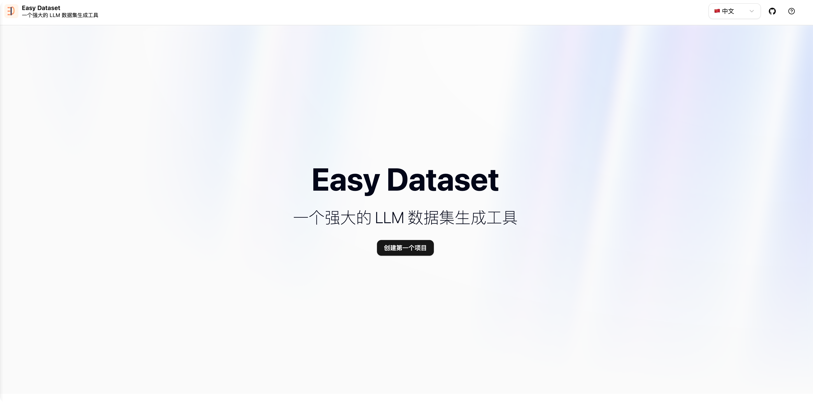
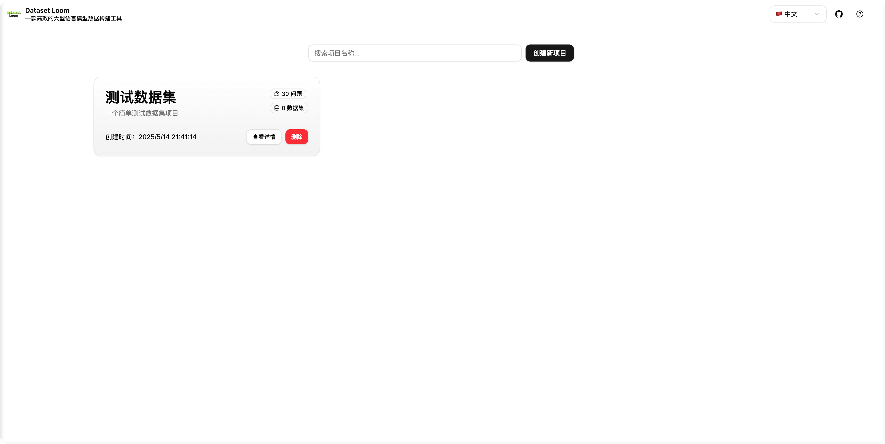
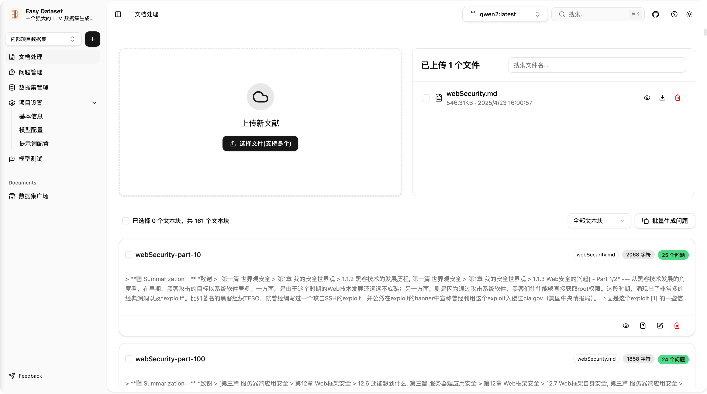
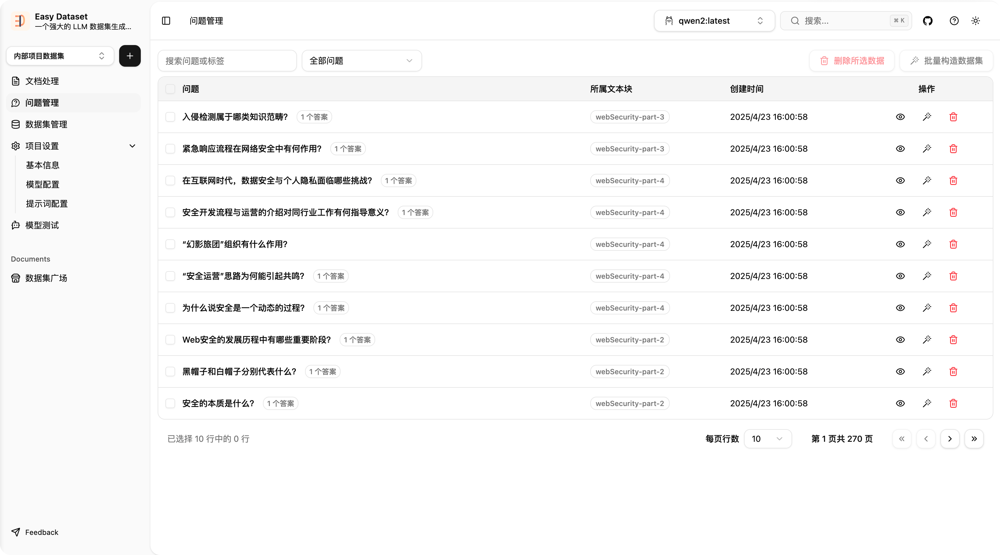
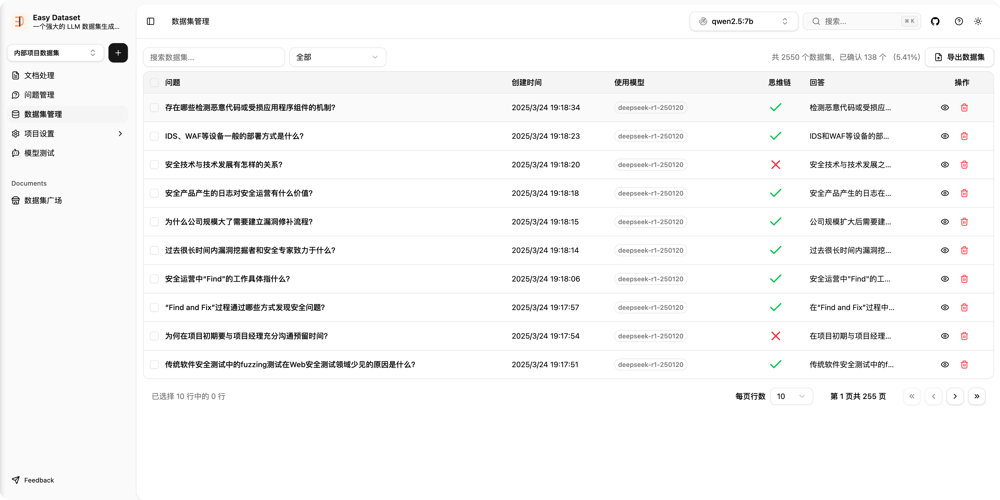
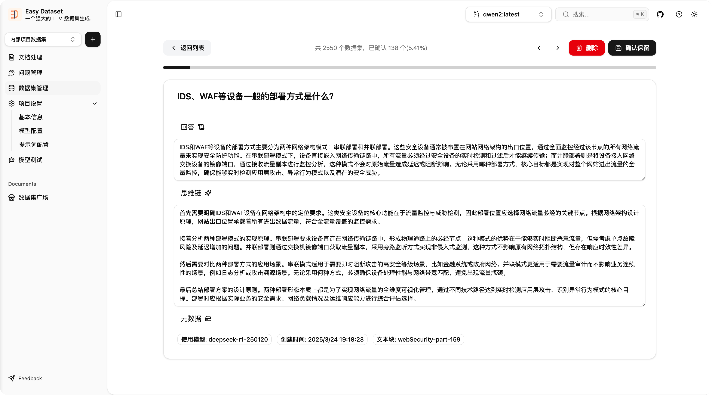

# Easy Dataset - shadcn/ui

> 一个基于 [Easy Dataset](https://github.com/ConardLi/easy-dataset) 的重构项目，采用 TypeScript + Next.js 15 + shadcn/ui 实现。

本项目对原始项目进行了全面升级与优化，包括：

- 从 JavaScript 迁移到 **TypeScript**
- 从 Material-UI (MUI) 转换为 **shadcn/ui**
- 从 **Next.js 14** 升级到最新的 **Next.js 15**
- 优化了组件结构、代码组织和样式系统

> 本项目是在 [Easy Dataset](https://github.com/ConardLi/easy-dataset) 的基础上进行的二次开发，感谢原作者的开源贡献。

### 🧱 技术变更说明

| 原功能/技术       | 当前替换/升级为           | 说明                             |
| ----------------- | ------------------------- | -------------------------------- |
| JavaScript        | TypeScript                | 提供更强的类型安全和开发体验     |
| Material-UI (MUI) | shadcn/ui                 | 更轻量、可定制的无样式 UI 组件库 |
| Next.js 14        | Next.js 15                | 使用最新 React 特性与性能优化    |
| 默认样式方案      | Tailwind CSS + 自定义主题 | 更灵活的样式控制                 |

---

## 🖼️ 截图（示例）










---

## 🚀 快速开始

按照以下步骤快速启动项目：

### 1. 克隆仓库

```bash
git clone https://github.com/599yongyang/easy-dataset-shadcnui.git
cd easy-dataset-shadcnui
```

### 2. 安装依赖

本项目使用 [pnpm](https://pnpm.io/) 进行包管理，请确保你已安装 pnpm：

```bash
pnpm install
```

> 💡 如未安装 pnpm，可通过 npm 快速安装：
>
> ```bash
> npm install -g pnpm
> ```

### 3. 启动开发环境

#### 开发服务器（热重载）：

```bash
pnpm run dev
```

服务默认运行在：👉 [http://localhost:2088](http://localhost:2088)

#### 预览生产构建效果：

```bash
pnpm run build
pnpm run preview
```

预览地址同上：👉 [http://localhost:2088](http://localhost:2088)

---
